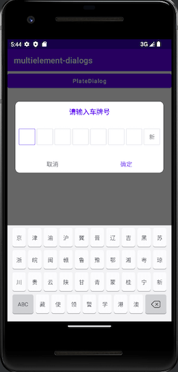

# multielement-dialogs
Direct to use, multiple, smooth, can be applied to Kotlin &amp; Android.
Under continuous development...

### Release Version：

## PlateDialog
### images
 

### use example 1
```gradle
    PlateDialog(this).show {
        setData("川A88888")
        setOnConfirmClickListener {
            Toast.makeText(this@MainActivity, it, Toast.LENGTH_SHORT).show()
        }
    }
```

### use example 2
```gradle
    PlateDialog(this).apply {
        setData("川A88888")
        setOnConfirmClickListener {
            Toast.makeText(this@MainActivity, it, Toast.LENGTH_SHORT).show()
        }
    }.show()
```

## CalendarDialog
### images
 

### use example 1
```gradle
    CalendarDialog(this).show {
        setDate("2023-7-24")
        setOnConfirmClickListener { calendar, yearOfMonthOfDay ->
            Toast.makeText(this@MainActivity, yearOfMonthOfDay, Toast.LENGTH_SHORT).show()
        }
    }
```
### use example 2
```gradle
    CalendarDialog(this, "yyyy/MM/dd").show {
        setDate("2023/7/24")
        setOnConfirmClickListener { calendar, yearOfMonthOfDay ->
            Toast.makeText(this@MainActivity, yearOfMonthOfDay, Toast.LENGTH_SHORT).show()
        }
    }
```

Step 1：Add it in your root build.gradle or setting.gradle at the end of repositories:
```gradle
    allprojects {
    	repositories {
    		...
    		maven { url 'https://jitpack.io' }
    	}
    }
```
Step 2. Add the dependency
```gradle
    dependencies {
	    implementation 'com.github.laconichy:multielement-dialogs:1.1.0'
	}
```

## Version Log:
### 1.0.0（2023-7-21）：
1、add PlateDialog
### 1.1.0（2023-7-25）：
1、add CalendarDialog